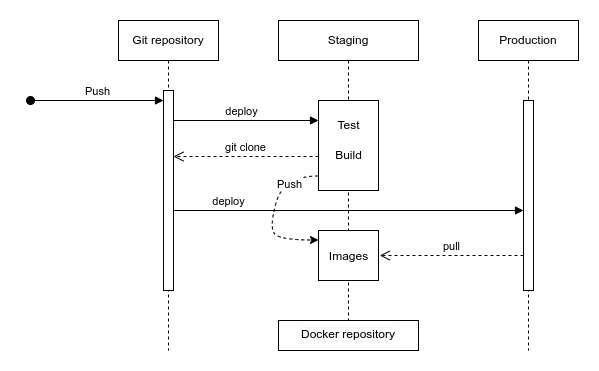

# 🐳 Docker CI/CD

This package provides a simple CI/CD pipeline for deploying applications using Docker.
It tests/builds your project and stores the docker images in a staging server.
After that, from a host environment you can run the images.

The package requires a single `Makefile.cicd` file in the root of your project to do it's job.

## Prerequisites

- [GIT 2.34.1](https://git-scm.com/)
- [Docker 20](https://www.docker.com/)
- [Docker Compose v2](https://www.docker.com/)

## Overview

This package consists of 3 different docker profiles/environments:
* `staging` - for testing, building and image storage
* `host` - for host environment
* `test` - for testing this package

### Flow diagram / components



Components:

* Pushing - pushing code to the repository
* Git repository - any source code repository
* Staging server - server for testing, building and docker image storage
* Host server - application host/server

## Getting started

### Clone the repository

```shell
git clone https://github.com/apajo/docker_cicd.git
```

### Setup

Create `.env.local` to override `.env` parameters.


| Variable           | Description                                   | Default value                              |
|--------------------|-----------------------------------------------|--------------------------------------------|
| `GIT_REPO`         | URL of you Git repository                     | `https://github.com/apajo/docker_cicd.git` |
| `PUBLIC_KEY`       | Authorized key for staging/host servers |                                            |
| `MAKE_FILE`        | Path/name of your CI/CD make file             | `Makefile.cicd`                            |
| `STAGING_HOST`     | Host for the staging environment              | `staging`                                  |
| `STAGING_PORT`     | Port for the staging environment              | `22`                                       |
| `STAGING_USER`     | User for the staging environment              | `cicd`                                     |


_Additionally, you can create `compose.override.yml` to override `compose.yml` parameters. For more info taht, checkout [here](https://docs.docker.com/compose/)_

> __NB!__ Make sure tou have setup your __Makefile.cicd__ file in your git repository.

### Git repo requirements

__NB!__ Your git repository root directory has to have a
__Makefile.cicd__ file with the following targets:
* install
* build
* test
* push
* deploy

Example __Makefile.cicd__:

```shell
.PHONY: install build test push deploy help
.DEFAULT_GOAL := install

help:           ## Show this help.
	@fgrep -h "##" $(MAKEFILE_LIST) | fgrep -v fgrep | sed -e 's/\\$$//' | sed -e 's/##//'

install:           ## Install (aka. prebuild) the containers
	docker compose --profile=build build

build:           ## Build the containers
	docker compose build

test:           ## Run tests in the containers
	docker compose --profile=test run --build --remove-orphans --rm test

push:           ## Push the built image
	docker compose push

deploy:           ## Deploy docker image
	docker compose pull
	docker compose up
```

### Run staging server

1. Clone this repo (https://github.com/apajo/docker_cicd)
2. Edit environment variables by creating `.env.local` file
3. Run:

```shell
docker compose --profile=staging up -d
```

### Run host server

1. Clone this repo (https://github.com/apajo/docker_cicd)
2. Edit environment variables by creating `.env.local` file
3. Setup your public keys in staging and host containers
4. Run:

```shell
docker compose --profile=host up -d
```

__Note!__ You can setup ad many hosts as needed (test, prelive, production, etc.) 

### Run in pipeline

If environments are setup you can run the following commands to deploy the application
(for example in CI/CD pipeline):

```shell
ssh cicd@staging bash -c "stage master 12345"
ssh cicd@production bash -c "deploy master 12345"
```

### Run tests

```shell
docker compose -f .docker/compose.yml -f .docker/compose.test.yml --profile=test run --name=tests --rm --remove-orphans test;
```

Force re-build:

```shell
docker compose -f .docker/compose.yml -f .docker/compose.test.yml --profile=test run --name=tests --rm --build --remove-orphans test;
```

## Helpers / shortcuts

All Images:
```shell
wget -O - http://localhost:5000/v2/_catalog
```

All Tags:
```shell
# Get the list of all images
IMAGES=$(wget -qO- http://localhost:5000/v2/_catalog | jq -r '.repositories[]')

# Loop through each image and get the tags
for IMAGE in $IMAGES; do
  echo "Tags for $IMAGE:"
  wget -qO- http://localhost:5000/v2/$IMAGE/tags/list | jq -r '.tags[]'
done
```


#### Enter interactive shell

```shell
docker exec -it --user cicd staging bash
```

#### Get public key from the container

```shell
docker exec -it --user cicd staging bash -c "cat ~/.ssh/id_rsa.pub"
```

#### Add your/host public key to authorized keys in the container

```shell
PUBLIC_KEY=$(cat $HOME/.ssh/id_rsa.pub); \
docker exec -it --user cicd host bash -c "echo $PUBLIC_KEY >> ~/.ssh/authorized_keys"
```

#### Add a domain to known hosts

```shell
read -p "Enter the domain: " DOMAIN; \
docker exec -it --user cicd staging bash -c "ssh-keyscan $DOMAIN >> ~/.ssh/known_hosts"
```

#### Clear containers:

```bash
docker stop $(docker ps -a -q); \
docker rm $(docker ps -a -q);
```

#### Setup Docker registry

```bash
docker run -d -p 5000:5000 --name local-registry registry:2
```
