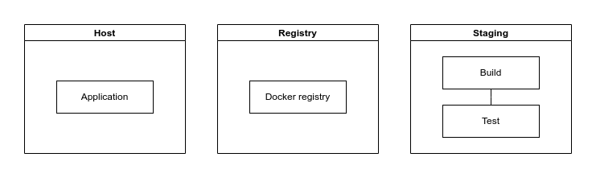

# 🐳 Docker CI/CD

This package provides a simple CI/CD pipeline for deploying applications using Docker.
It tests/builds your project and stores the docker images in a staging server.
After that, from a host environment you can run the images.

The package requires a single `Makefile.cicd` file in the root of your project to do it's job.

## Prerequisites

- [Linux Kernel 5.1](https://kernel.org/)
- [Runc 1.1.12](https://github.com/opencontainers/runc)
- [GIT 2.34.1](https://git-scm.com/)
- [Docker 20](https://www.docker.com/)
- [Docker Compose v2](https://www.docker.com/)

## Overview



Components:
* `Host` - Contains your running application
* `Staging` - Builds, tests and and sends Docker images to registry
* `Registry` - Private Docker image regsitry

### Flow diagram / components


1) Push (GIT) - If your code is pushed to the repository, the pipeline is triggered
2) Deploy - Pipeline  triggers staging sequence in the staging server
3) Clone - Staging server clones your repository, buils, tests and pushes the images to the registry
4) Deploy - Pipeline triggers deploy sequence in the host server
5) Pull - Host server pulls the images from the registry and runs them

## Getting started

### Clone the repository

```shell
git clone https://github.com/apajo/docker_cicd.git
```

### Setup

#### .env.local

Create `.env.local` to override `.env` parameters.

| Variable                 | Description                                   | Default value                              |
|--------------------------|-----------------------------------------------|--------------------------------------------|
| `GIT_REPO`               | URL of you Git repository                     | `https://github.com/apajo/docker_cicd.git` |
| `PUBLIC_KEY`             | Authorized key for staging/host servers       |                                            |
| `MAKE_FILE`              | Path/name of your CI/CD make file             | `Makefile.cicd`                            |
| `STAGING_SSH_DSN`        | Host for the staging environment              | `cicd@staging:22`                          |
| `REGISTRY_KEEP_TAGS_COUNT`| Number of tags to keep in the registry        | `10`                                       |
| `REGISTRY_KEEP_TAGS`     | Tags to keep in the registry                  | `"stable latest"`                          |
| `REGISTRY_KEEP_TAGS_LIKE`| Pattern of tags to keep in the registry       | `live`                                     |
| `TESTS_SERVICE`| Name of the docker compose service to be run in tests phase       | `tests`                                     |


#### compose.override.yml

_Additionally, you can create `compose.override.yml` to override Docker compose parameters.
For more info that, checkout [here](https://docs.docker.com/compose/)_

```yml
services:
  staging:
    ports: !override
      - "1252:22"
      - "8080:80"
    dns:
      - 8.8.8.8
      - 8.8.4.4
    extra_hosts:
      - "registry:external.registry.com"
```

This example will override the default configuration of your staging server.
* ports         - overrides default staging server ports
* dns           - overrides default DNS servers
* extra_hosts   - forwards registry hostname to external.registry.com

#### Environment specific files

All environment specific files are located in `env` directory.
Everything in the `env` directory is copied to toy your project's root directory before building it.

### Run the servers

```shell
docker compose up -d
```

Run each server individually (to run the services in different networks):

```shell
* docker compose up -d [service]
```

### Requirements for your project

Your project needs to have docker compose (`compose.yml` or `docker-compose.yml`) in it's root directory.


For more (customize build commands etc) read [this](./docs/README.md)

### Run in pipeline

If environments are setup you can run the following commands to deploy the application
(for example in CI/CD pipeline):

```shell
ssh cicd@staging bash -c "stage master 12345"
ssh cicd@production bash -c "deploy master 12345"
```

## Run tests

```shell
docker compose -f .docker/compose.yml -f .docker/compose.test.yml run --rm --remove-orphans test;
docker compose -f .docker/compose.yml -f .docker/compose.test.yml down;
```

## Detailed instructions

For more read [this](./.docker/README.md)

